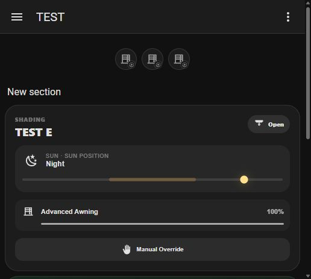
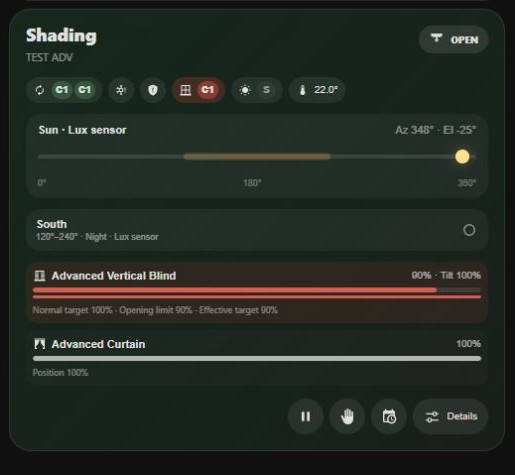
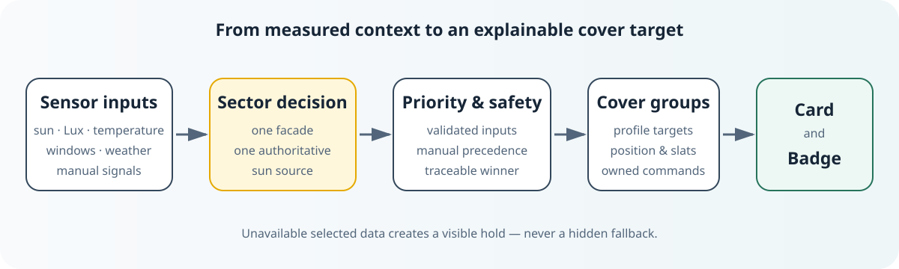
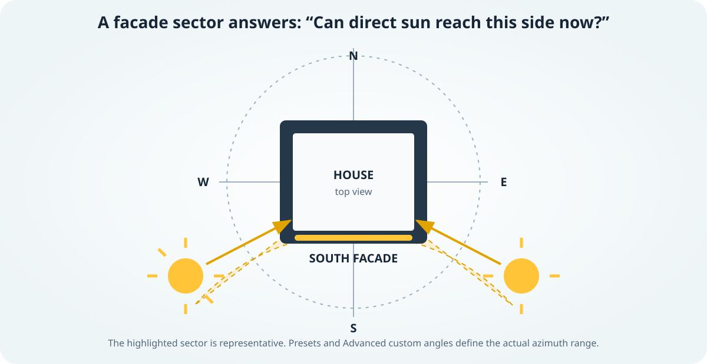

<p align="right"><a href="docs/de/README.md">Deutsch</a> · <strong>English</strong></p>

<p align="center">
  <picture>
    <source media="(prefers-color-scheme: dark)" srcset="custom_components/smart_shading/brand/dark_logo@2x.png">
    
  </picture>
</p>

<p align="center">
  <a href="https://github.com/MrCharly169/smart-shading/actions/workflows/validate.yml"></a>
  <a href="https://github.com/MrCharly169/smart-shading/releases"></a>
  <a href="https://github.com/MrCharly169/smart-shading/stargazers"></a>
  <a href="https://github.com/MrCharly169/smart-shading/releases"></a>
  <a href="https://hacs.xyz/docs/faq/custom_repositories/"></a>
  <a href="#requirements-and-limitations"></a>
  <a href="LICENSE"></a>
</p>

> **Beta channel:** the current `develop` release line uses GitHub prereleases. Choose prereleases in HACS only if you intentionally want to test beta builds. The latest non-prerelease remains the stable channel.

**Smart Shading turns Home Assistant cover entities into context-aware shading that reacts to the real sun, room conditions, and explicit safety or manual signals instead of relying only on fixed times.**

## Why Smart Shading?

Fixed schedules cannot tell whether sunlight is actually reaching a facade, whether a room needs protection, or whether a person has taken control. Smart Shading combines the sun position with the configured facade sector and only the room inputs you select.

- **Sun-aware:** decisions follow facade direction and current sun geometry, a local Lux source, or an external direct-sun signal.
- **Room-aware:** optional temperature, occupancy, weather, window, Night, and Safety inputs refine Advanced decisions.
- **Deliberately understandable:** the Card, Badge, status sensors, and diagnostics show the active mode and reason.
- **Manual control first:** explicit overrides and detected external movement can pause automation; active Safety still has the highest priority.
- **No hidden guesses:** an unavailable selected source creates a visible hold instead of silently substituting weather, Lux, geometry, or a zero value.

Smart Shading is intended for Home Assistant users who already have cover entities and want adaptive facade-based control. Easy Mode suits a straightforward first installation; Advanced Mode suits homes that need selected schedules, protection layers, temperature stages, or detailed diagnostics. It is not a hardware driver, a weather service, or a replacement for actuator-level safety limits.

## See it in Home Assistant

The screenshots below come from the repository's disposable Home Assistant E2E laboratory with neutral fixture data. They show the real bundled frontend, not mock-ups or a private installation.

| Easy Mode | Advanced Mode |
| --- | --- |
|  |  |
| A compact room view with the essential state and one override. | A detailed view with selected inputs, targets, constraints, and diagnostics access. |

<p align="center"></p>
<p align="center"><em>Native round Home Assistant badges for a house and rooms. The cover glyph stays recognizable while the marker and theme color communicate state.</em></p>

## How it works



Each sun sector represents the part of the sky that can reach one facade. A sector uses exactly one authoritative sun source; room and cover-group context then determine the target.



## Quick Start

1. Confirm that Home Assistant `2026.6.0` or newer provides `sun.sun` and the cover entities you want to control.
2. Install Smart Shading through HACS as a **custom Integration repository** or copy it manually, then restart Home Assistant.
3. Add **Smart Shading** under **Settings → Devices & services → Add integration**, choose Easy or Advanced, and complete one room, sector, cover group, and cover.
4. Register `/smart_shading/shading.js` once as a JavaScript module and add the Card or Badge YAML shown below.
5. Test the resulting targets with neutral conditions before relying on automatic movements.

## Installation

### HACS custom repository

Smart Shading is not installed from the default HACS catalog. Add it once as a custom repository:

1. Open **HACS → Integrations**.
2. Open the HACS menu and choose **Custom repositories**.
3. Enter `https://github.com/MrCharly169/smart-shading`.
4. Select category **Integration** and add the repository.
5. Open **Smart Shading**, select **Download**, and restart Home Assistant.
6. For stable use, keep prereleases disabled. Enable prereleases only when you deliberately want the beta channel.

HACS installs the source belonging to a published GitHub release. `hacs.json` hides the unversioned default branch so development snapshots are not offered as releases.

### Manual installation

1. Download the ZIP attached to the desired [GitHub release](https://github.com/MrCharly169/smart-shading/releases).
2. Copy the included `custom_components/smart_shading` directory to your Home Assistant configuration so the final path is:

   ```text
   <config>/custom_components/smart_shading
   ```

3. Restart Home Assistant.

Do not copy only the frontend file; the integration, translations, services, and Card are shipped together.

## First setup

### Add the integration

1. Go to **Settings → Devices & services → Add integration**.
2. Search for **Smart Shading**.
3. Choose **Easy** or **Advanced**. This choice is fixed for that config entry; create a new entry to use the other setup variant.
4. Name the house or area and add a room.
5. Add a facade sector, choose its single sun source, create a cover group, select its physical profile, and assign covers.
6. In Advanced Mode, select only the optional capabilities the room actually needs.
7. Review and save. Incomplete sectors, groups, covers, or dependent options are rejected by the wizard.

Home Assistant's `sun.sun` is used automatically. If the Sun integration is missing or unavailable, Smart Shading stops sector setup and reports what must be restored.

### Register the dashboard resource

Register the bundled frontend once under **Settings → Dashboards → Resources**:

```text
URL:  /smart_shading/shading.js
Type: JavaScript module
```

The URL is intentionally versionless. Updates replace the JavaScript behind the same path. Older `/smart_shading/smart-shading-card.js?v=...` entries still load through a compatibility loader, but should be migrated once to the canonical URL above.

### Add a Card

```yaml
type: custom:smart-shading-card
entity: sensor.YOUR_ROOM_STATUS
```

The Card derives Easy or Advanced presentation from the config entry; it has no independent mode switch.

### Add a Badge

```yaml
type: entity
entity: sensor.YOUR_ROOM_OR_HOUSE_STATUS
show_name: false
show_icon: true
show_state: true
color: state
```

Select the house or room status sensor with Home Assistant's standard **Entity** Badge. Its enum state and state-dependent icon come directly from Smart Shading; conditional display is configured only in Home Assistant's native Visibility tab. Selecting the optional dashboard-badges feature during setup creates onboarding guidance, but Smart Shading never edits an existing dashboard automatically.

## Easy or Advanced?

| | Easy Mode | Advanced Mode |
| --- | --- | --- |
| Best for | A clear facade-based setup with safe defaults | Rooms that need explicitly selected extra behavior |
| Sun source | One source per sector: geometry, Lux, or external on/off | The same choices, plus editable thresholds, delays, and custom geometry |
| Temperature | Optional outdoor sensor automatically adds its minimum condition | Optional indoor/outdoor temperature stages and related controls |
| Manual control | One indefinite room-level Manual Override | Room and per-cover pause/override behavior, with opt-in external-movement detection |
| Optional features | Dashboard badge guidance | Schedules, Night, Safety, conditions, glare protection, maximum opening, test tools, and expert execution settings |
| Diagnostics | Compact status and reason | Decision trace, rejected rules, input quality, targets, protected zones, and command lifecycle |

Easy is intentionally small: few choices, profile defaults, one source per sector, and one understandable override. Advanced begins with the same base shading and activates only capabilities selected for that room. Unselected Advanced features do not run in the background and do not add controls to the Card.

### Decision and safety philosophy

For Advanced decisions, the immutable order verified by code and tests is:

1. active **Safety**;
2. manual master override, room pause, or local cover pause;
3. hold for an unavailable configured Safety or Night source;
4. **Night**;
5. **Heat Protection**;
6. schedule or normal-input-quality hold;
7. **Glare Protection**;
8. **Solar**;
9. **Comfort**;
10. **Open** or idle hold.

Every matching and rejected candidate is retained in the Advanced trace with a stable reason and normalized input quality. Command planning happens afterwards. A newer higher-priority target cancels obsolete delayed work. See [Advanced behavior](docs/ADVANCED_MODE.md) and the [mode architecture](docs/MODE_ARCHITECTURE.md) for the full technical contract.

## Supported cover profiles

| Profile | Control model |
| --- | --- |
| Exterior Venetian blind | Position plus slat guidance, including adaptive slat curves |
| Roller shutter | Position targets |
| Exterior or zip screen | Position targets |
| Interior curtain | Position targets |
| Vertical blind | Position plus slat guidance |
| Awning | Position targets with retracted neutral and Safety position |
| Simple open/close cover | Open/close services only; no numeric target fields |

The selected physical profile changes wizard fields, defaults, commands, entities, and Card presentation. Wind and frost Safety sources are offered only for exterior profiles where they are applicable. Changing a profile resets incompatible profile values while retaining assigned covers.

Home Assistant cover position semantics are `0%` closed and `100%` open. Smart Shading's slat convention is the KNX-oriented scale used by its profiles: `0%` open/light-through and `100%` closed/light-blocking. Use **Invert slats** only when a supported cover reports the opposite direction.

## Requirements and limitations

- Home Assistant `2026.6.0` or newer.
- The native Sun integration and an available `sun.sun` entity.
- Existing Home Assistant cover entities; Smart Shading does not communicate with motors directly.
- Exactly one sun source per sector. Sources are not combined and there is no hidden fallback.
- Without an outdoor-temperature sensor, outdoor temperature is ignored. If a selected sensor is unavailable, its configured condition is not treated as satisfied.
- Easy/Advanced is fixed per config entry.
- The general Advanced shading schedule permits all daytime modes; Night has its own independent source or Sun-relative period.
- Calculated object-glare geometry is available only for compatible Advanced profiles; exterior Venetian blinds and awnings are not offered by that calculator, and vertical-slat results are approximate.
- Software automation cannot replace physical end stops, actuator protections, or appropriate wind/frost safeguards. Validate targets and fail-safe behavior for your installation.

### Local processing and privacy

Smart Shading reads entity states, calculates decisions, stores its runtime data, and calls cover services inside Home Assistant. Its manifest declares the `calculated` IoT class, has no third-party Python requirements, and the integration contains no cloud client or telemetry endpoint. This statement applies to Smart Shading itself; Home Assistant, HACS, and the integrations that provide your entities may have their own network and privacy behavior.

## Updating

1. Update Smart Shading in HACS, or replace the complete `custom_components/smart_shading` directory with the files from a newer release.
2. Restart Home Assistant.
3. Reload the browser or companion app if it still holds older Card code.

Keep `/smart_shading/shading.js` unchanged and do not add a version query.

## Uninstalling

1. Remove the Smart Shading config entry under **Settings → Devices & services**.
2. Remove Smart Shading in HACS, or delete `<config>/custom_components/smart_shading` for a manual installation.
3. Restart Home Assistant.
4. If no other Smart Shading entry remains, remove `/smart_shading/shading.js` from dashboard resources and remove Cards or Badges from your dashboards.

Removing the integration does not remove or reconfigure the cover entities supplied by other integrations.

## FAQ and troubleshooting

**The Card says “Custom element doesn't exist.”**

Confirm that `/smart_shading/shading.js` is registered as a JavaScript module, restart Home Assistant after installation, then reload the browser or companion app.

**Why is normal shading waiting?**

Check the Card reason and the room status sensor. The sun may be outside the sector, the schedule or temperature condition may be inactive, or the selected Lux/external/temperature input may be unavailable. Smart Shading does not substitute another source.

**Do I need a Lux or outdoor-temperature sensor?**

No. A sector can use sun geometry alone, and outdoor temperature is ignored when no sensor is selected. Lux and external direct-sun entities are alternative authoritative sources, not extra fallbacks.

**Can I switch an existing entry from Easy to Advanced?**

No. The setup contract is fixed to prevent hidden cross-mode settings. Create a separate config entry and configure it deliberately.

**Home Assistant shows false KNX cover movement. What should I check?**

See the [KNX troubleshooting guide](docs/FAQ.md#why-does-home-assistant-show-a-knx-cover-moving-although-the-motor-is-idle) before changing actuator or state-updater settings.

More answers are in the [FAQ](docs/FAQ.md). For setup help, use [Support](SUPPORT.md). For a reproducible defect, search existing [issues](https://github.com/MrCharly169/smart-shading/issues) and open the Bug Report template with sanitized diagnostics. Security issues follow [SECURITY.md](SECURITY.md).

## License and voluntary support

Smart Shading is open-source software under the [MIT License](LICENSE). Private and commercial use are permitted under the terms of that license; there is no separate commercial license or fee. The software is provided without warranty as described in the license.

Voluntary sponsorship can help fund development, testing, documentation, and maintenance, but it is never a license fee. **Funding-link placeholder:** no verified Buy Me a Coffee or GitHub Sponsors URL is currently present in this repository, so no funding badge has been added.

## Technical documentation and development

- [Advanced behavior](docs/ADVANCED_MODE.md)
- [Mode and decision architecture](docs/MODE_ARCHITECTURE.md)
- [Setup-wizard behavior contract](docs/SETUP_WIZARD_REVIEW.md)
- [Home Assistant E2E laboratory](docs/HA_E2E_LAB.md)
- [Regression matrix](docs/REGRESSION_MATRIX.md)
- [Development guide](docs/DEVELOPMENT.md)
- [Contributing](CONTRIBUTING.md)
- [Changelog](CHANGELOG.md)
